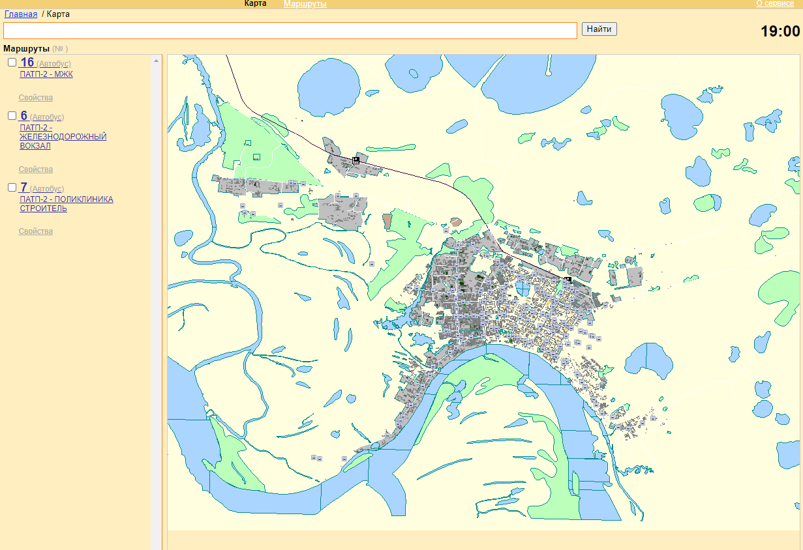
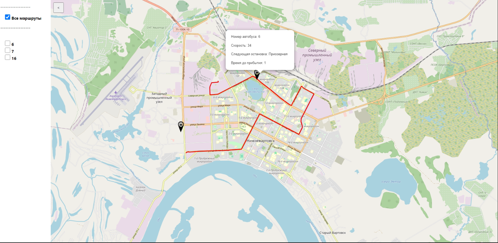

# bus_nizhnevartovsk
## Создать сайт для отображения маршрута движения автобусов на карте. 
Нужно заменить картографическую основу у уже существующего сайта. Для реализации были использованы:
- Express 
- React
  - [react-lefleat](https://react-leaflet.js.org/docs/start-setup/) 
- MSSQL
- CORS

Повторно использовались только запросы в СУБД.
Был разработан свой сервер, который отправляет 3 пакета данных, а именно: 
- координаты транспорта (долгота, широта, скорость)
- координаты остановок
- координаты движения транспорта
  
## Установка и запуск
1. Склонируйте репозиторий на свой локальный компьютер:
``` bash
git clone https://github.com/LlienlL/bus_nizhnevartovsk.git
```
2. Перейдите в каталог проекта:
``` bash
cd bus_nizhnevartovsk
```
3. Установите зависимости:
``` bash
npm install
```
4. Запустите приложение:
``` bash
npm run start
```
5. Откройте веб-браузер и перейдите по адресу http://localhost:3000 для просмотра сайта.
   
До изменений сайт выглядит данным образом:    
официальный сайт [patp2/monitoring](http://www.patp2-nv.ru/monitoring/)

Я взял уже существующую карту [openstreepmap](https://www.openstreetmap.org/#map=0/18/-44) и на её основе добавил методы из библиотеке leaflet. Добавил Polyline для отображения движения трансорта, Marker для основок и транспорта на карте. Координаты транспорта мониторятся каждую секунду, данные хранятся в базе данный (MSSQL)

Создал удобное переключение выбора транспорта, что бы можно было выбрать только нужные маршруты.
Таким образом карта выглядит так

Это не финальный вариант.
